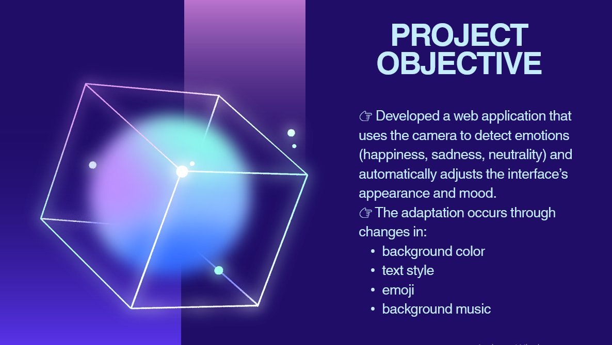

# Emotion-Based Adaptive UI

This repository contains the final presentation for the project:
**"Emotion-Based Adaptive User Interface"**, created as part of the subject: *Advanced Interactive Technologies*.

## Contents

- 🎥 [Demo Video – Adaptive User Interfaces Based on AI](Demo%20video.mp4)
- 📄 [Project Presentation – Adaptive User Interfaces Based on AI (PPTX)](ADAPTIVE%20USER%20INTERFACES%20BASED%20ON%20AI.pptx)
- 🖼️ Interface Screenshot:
  
  

## Model Files

The emotion recognition models used in this project are not included in the repository due to file size limitations.  
They are loaded at runtime via CDN from the official `face-api.js` repository:

👉 [https://github.com/justadudewhohacks/face-api.js-models](https://github.com/justadudewhohacks/face-api.js-models)

Or directly via:

```js
https://cdn.jsdelivr.net/npm/@vladmandic/face-api/model/


## Technologies used
- HTML, CSS, JavaScript
- face-api.js
- Webcam API
- Visual Studio Code, OBS Studio

This repository contains the final assets for the project **"Adaptive User Interfaces Based on AI"**, developed as part of the subject *Advanced Interactive Technologies*.
The system uses real-time facial emotion detection (happy, sad, neutral) via webcam to dynamically adapt the user interface’s visuals, text, emojis, and background music.
